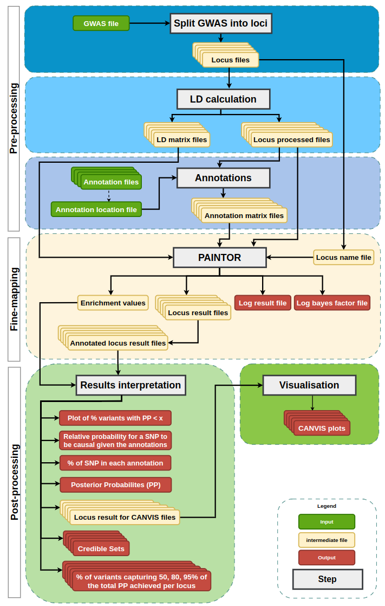

# PaintorPipe
`PaintorPipe` is a pipeline that performs fine-mapping analysis, using GWAS summary statistics data and diverse functionnal annotations, implemented in [Nextflow](#https://www.nextflow.io/).
This pipeline runs the [Paintor program](#https://github.com/gkichaev/PAINTOR_V3.0) and its associated visualization tools and can be run locally or on a slurm cluster and handles containerisation using [Singularity](#https://github.com/sylabs/singularity).



# Table of Contents
- [Dependencies](#dependencies)
- [Usage](#usage)
  - [Pull the pre-built container](#pull-the-pre-built-container)
  - [Local Machine](#local-machine)
  - [Slurm compute cluster](#running-on-a-compute-cluster-with-slurm)
- [Pipeline's parameters](#pipeline-parameters)
  - [Input options](#input-options)
  - [Output options](#output-options)
  - [Nextflow options](#nextflow-options)
- [Example on a small dataset](#example-on-a-small-dataset)
  - [GWAS summary statistics](#gwas-summary-statistics)
  - [Functionnal Annotations](#functionnal-annotations)
  - [Outputs](#outputs)
- [Citation](#citation)


# Dependencies
To use this pipeline you will need:
- `Nextflow` >= 21.10.6
- `Singularity` >= 3.7.3

# Usage
A small dataset `CAD_META_extract` is provided to test this pipeline ([Example on a small dataset](#example-on-a-small-dataset) section). To try it out, use one of the following commands after pulling the pre-built container (singularity image).

## Pull the pre-built container
You can pull the image we built for `PaintorPipe` from our repository on [Sylabs cloud](#https://cloud.sylabs.io/) using the command below :
```bash
singularity pull --arch amd64 library://zgerber/paintorpipe/mainimage:0.1
```

## Local Machine
If you are running the pipeline on a local machine with limited resources and want to use the default configuration (at least 2 CPUs/4G mem), use this command:
```bash
nextflow run main.nf -config nextflow.config --gwasFile 'data/input/CAD_META_extract' --annotationsFile 'data/input/annotations.txt' --ref_genome 'hg19' --chromosome_header 'Chr' --pvalue_nonlead '1' --snp '100000' --pp_threshold '0.001' -profile singularity -resume > paintorpipe.test.small.out
```

## Running on a Compute Cluster with Slurm
If you have access to a compute cluster that uses the Slurm Workload Manager and you want to utilize the resources available there (at least 22 CPUs / 60 G mem), use this command with the slurm profile (a more complete file called `launch_pp.sh` can be found in the code directory):
```bash
nextflow run main.nf -config nextflow.config --gwasFile 'data/input/CAD_META_extract' --annotationsFile 'data/input/annotations.txt' --ref_genome 'hg19' --chromosome_header 'Chr' --pvalue_nonlead '1' --snp '100000' --pp_threshold '0.001' -profile singularity,slurm -resume > paintorpipe.test.small.out
```

# Pipeline parameters
## Input options

<table>
  <thead>
      <tr>
      <th width=200px>Option</th>
      <th width=200px>By default, example</th>
      <th width=350px>Description</th>
      <th width=90px>Required</th>
    </tr>
  </thead>
  <tbody>
    <tr>
      <td nowrap><strong><code>--gwasFile</code></strong></td>
      <td nowrap><code>path/to/GWAS_FILE</code></td>
      <td>The GWAS file must contains at least these 8 columns: rsID, Allele1, Allele2, Effect (Beta), StdErr (SE), Pvalue, CHR, BP. While the order is not important, the name of the column is (see the header parameters below to change the default names of the columns).</td>
      <td align=center>Required</td>
    </tr>
    <tr>
      <td nowrap><strong><code>--annotationsFile</code></strong></td>
      <td nowrap><code>path/to/ANNOTATIONS_FILE</code></td>
      <td>The file should contain 2 columns separeted by a tabulation. The first one is the name of the annotation (exon for an exon file for instance) and the second one is the path to the associated annotation file.</td>
      <td align=center>Required</td>
    </tr>
   <tr>
      <td nowrap><strong><code>--ref_genome</code></strong></td>
      <td nowrap><code>hg19</code></td>
      <td>Only two values are allowed: 'hg19' or 'hg38'. Make sure you are using the reference genome that corresponds to your summary statistics GWAS file, because the results of the pipeline will be incorrect otherwise.</td>
      <td align=center>Optional</td>
    </tr>
   <tr>
      <td nowrap><strong><code>--population</code></strong></td>
      <td nowrap><code>EUR</code></td>
      <td>Specifies the name of the mainland population: AFR, AMR, EAS, EUR, SAS.</td>
      <td align=center>Optional</td>
    </tr>
   <tr>
      <td nowrap><strong><code>--pvalue_header</code></strong></td>
      <td nowrap><code>Pvalue</code></td>
      <td>Header Pvalue column name</td>
      <td align=center>Optional</td>
    </tr>
   <tr>
      <td nowrap><strong><code>--stderr_header</code></strong></td>
      <td nowrap><code>StdErr</code></td>
      <td>Header Standard Error (SE) column name</td>
      <td align=center>Optional</td>
    </tr>
   <tr>
      <td nowrap><strong><code>--effect_header</code></strong></td>
      <td nowrap><code>Effect</code></td>
      <td>Header Effect (BETA) column name</td>
      <td align=center>Optional</td>
    </tr>
   <tr>
      <td nowrap><strong><code>--chromosome_header</code></strong></td>
      <td nowrap><code>CHR</code></td>
      <td>Header Chromosome column name</td>
      <td align=center>Optional</td>
    </tr>
   <tr>
      <td nowrap><strong><code>--effectallele_header</code></strong></td>
      <td nowrap><code>Allele1</code></td>
      <td>Header Allele with effect column name</td>
      <td align=center>Optional</td>
    </tr>
  <tr>
      <td nowrap><strong><code>--altallele_header</code></strong></td>
      <td nowrap><code>Allele2</code></td>
      <td>Header Allele without effect column name</td>
      <td align=center>Optional</td>
    </tr>
  <tr>
      <td nowrap><strong><code>--position_header</code></strong></td>
      <td nowrap><code>BP</code></td>
      <td>Header Variant position in the chromosome column name</td>
      <td align=center>Optional</td>
    </tr>
    <tr>
      <td nowrap><strong><code>--rsid_header</code></strong></td>
      <td nowrap><code>rsID</code></td>
      <td>Header Unique variant identifier or markermane</td>
      <td align=center>Optional</td>
    </tr>
  <tr>
  <tr>
      <td nowrap><strong><code>--zheader_header</code></strong></td>
      <td nowrap><code>Zscore</code></td>
      <td>The computed zscore is added in a new column, corresponding to the Effect/StdErr for each SNP, for each locus.</td>
      <td align=center>Optional</td>
    </tr>
  <tr>
      <td nowrap><strong><code>--kb</code></strong></td>
      <td nowrap><code>500</code></td>
      <td>SNPs selection distance in kilo bases upstream and downstream of the lead SNP during the split of the GWAS file.</td>
      <td align=center>Optional</td>
    </tr>
  <tr>
      <td nowrap><strong><code>--pp_treshold</code></strong></td>
      <td nowrap><code>0.001</code></td>
      <td>Significant posterior probability threshold.</td>
      <td align=center>Optional</td>
    </tr>
  <tr>
      <td nowrap><strong><code>--snp</code></strong></td>
      <td nowrap><code>10000000</code></td>
      <td>Number of significant SNPs to keep.</td>
      <td align=center>Optional</td>
    </tr>
  <tr>
      <td nowrap><strong><code>--pvalue_lead</code></strong></td>
      <td nowrap><code>5e-08</code></td>
      <td>Significant Pvalue threshold for lead SNP.</td>
      <td align=center>Optional</td>
    </tr>
  <tr>
      <td nowrap><strong><code>--pvalue_nonlead</code></strong></td>
      <td nowrap><code>1</code></td>
      <td>Significant Pvalue threshold for other SNPs around the lead SNP.</td>
      <td align=center>Optional</td>
    </tr>
  </tbody>
</table>

## Output options

<table>
  <thead>
    <tr>
      <th width=200px>Option</th>
      <th width=200px>By default, example</th>
      <th width=350px>Description</th>
      <th width=90px>Required</th>
    </tr>
  </thead>
  <tbody>
    <tr>
      <td nowrap><strong><code>--outputDir_locus</code></strong></td>
      <td nowrap><code>data/output_locus</code></td>
      <td></td>
      <td align=center>Optional</td>
    </tr>
    <tr>
      <td nowrap><strong><code>--outputDir_sorted_locus</code></strong></td>
      <td nowrap><code>data/output_sorted_locus</code></td>
      <td></td>
      <td align=center>Optional</td>
    </tr>
    <tr>
      <td nowrap><strong><code>--outputDir_VCFandMAPfrom1000G</code></strong></td>
      <td nowrap><code>data/output_VCF_map_files</code></td>
      <td></td>
      <td align=center>Optional</td>
    </tr>
    <tr>
      <td nowrap><strong><code>--outputDir_ld</code></strong></td>
      <td nowrap><code>data/output_ld</code></td>
      <td></td>
      <td align=center>Optional</td>
    </tr>
    <tr>
      <td nowrap><strong><code>--outputDir_bed</code></strong></td>
      <td nowrap><code>data/output_bed</code></td>
      <td></td>
      <td align=center>Optional</td>
    </tr>
    <tr>
      <td nowrap><strong><code>--outputDir_annotations</code></strong></td>
      <td nowrap><code>data/output_annotations<annotations/code></td>
      <td></td>
      <td align=center>Optional</td>
    </tr>
    <tr>
      <td nowrap><strong><code>--outputDir_annotated_locus</code></strong></td>
      <td nowrap><code>data/output_annotated_locus<annotations/code></td>
      <td></td>
      <td align=center>Optional</td>
    </tr>
    <tr>
      <td nowrap><strong><code>--outputDir_paintor</code></strong></td>
      <td nowrap><code>data/output_paintor<annotations/code></td>
      <td></td>
      <td align=center>Optional</td>
    </tr>
    <tr>
      <td nowrap><strong><code>--outputDir_results</code></strong></td>
      <td nowrap><code>data/output_results<annotations/code></td>
      <td></td>
      <td align=center>Optional</td>
    </tr>
    <tr>
      <td nowrap><strong><code>--outputDir_posteriorprob</code></strong></td>
      <td nowrap><code>data/output_posteriorprob<annotations/code></td>
      <td></td>
      <td align=center>Optional</td>
    </tr>
    <tr>
      <td nowrap><strong><code>--outputDir_plot</code></strong></td>
      <td nowrap><code>data/output_plot<annotations/code></td>
      <td></td>
      <td align=center>Optional</td>
    </tr>
    <tr>
      <td nowrap><strong><code>--outputDir_canvis</code></strong></td>
      <td nowrap><code>data/output_canvis<annotations/code></td>
      <td></td>
      <td align=center>Optional</td>
    </tr>
  </tbody>
</table>

## Nextflow options
The pipeline is written in Nextflow, which provides the following default options:

<table>
  <thead>
    <tr>
      <th width=200px>Option</th>
      <th width=200px>By default, example</th>
      <th width=350px>Description</th>
      <th width=90px>Required</th>
    </tr>
  </thead>
  <tbody>
    <tr>
      <td nowrap><strong><code>-profile</code></strong></td>
      <td nowrap><code>singularity</code></td>
      <td>Profile(s) to use when running the pipeline. Use it to specify the profiles that fit your infrastructure among <code>singularity</code>, <code>slurm</code>.</td>
      <td align=center>Required</td>
    </tr>
    <tr>
      <td nowrap><strong><code>-config</code></strong></td>
      <td nowrap><code>nextflow.config</code></td>
      <td>
        Configuration file tailored to your infrastructure and dataset.
      </td>
      <td align=center>Optional</td>
    </tr>
    <tr>
      <td nowrap><strong><code>-revision</code></strong></td>
      <td nowrap><code>version</code></td>
      <td>Version of the pipeline to launch.</td>
      <td align=center>Optional</td>
    </tr>
    <tr>
      <td nowrap><strong><code>-work-dir</code></strong></td>
      <td nowrap><code>directory</code></td>
      <td>Work directory where all temporary files are written.</td>
      <td align=center>Optional</td>
    </tr>
    <tr>
      <td nowrap><strong><code>-resume</code></strong></td>
      <td nowrap></td>
      <td>Resume the pipeline from the last completed process.</td>
      <td align=center>Optional</td>
    </tr>
    <tr>
      <td nowrap><strong><code>-with-report</code></strong></td>
      <td nowrap></td>
      <td>Nextflow can create an HTML execution report. It is a single document that includes many useful metrics about the pipeline's execution</td>
      <td align=center>Optional</td>
    </tr>
    <tr>
      <td nowrap><strong><code>-with-timeline</code></strong></td>
      <td nowrap></td>
      <td>Nextflow can display a timeline in HTML format for all processes run in the pipeline</td>
      <td align=center>Optional</td>
    </tr>
  </tbody>
</table>

For more Nextflow options, see [Nextflow's documentation](https://www.nextflow.io/docs/latest/cli.html#run).


# Example on a small dataset
## GWAS summary statistics
`CAD_META_extract` GWAS file is an extract of the GWAS results from the latest `Coronary Artery Disease` (CAD) meta-analysis involving 122,733 cases and 424,528 controls ([van der Harst P et al, 2018](#https://www.ncbi.nlm.nih.gov/pmc/articles/PMC5805277/)).

```bash
unzip CAD_META_extract.zip
head CAD_META_extract
```
```
MarkerName	Allele1	Allele2	Freq1	FreqSE	MinFreq	MaxFreq	Effect	StdErr	Pvalue	Direction	HetISq	HetChiSq	HetDf	HetPVal	rsID	Chr	BP
11:120148567_A_T	a	t	0.3104	0.0219	0.2941	0.3398	0.0099	0.0065	0.1267	++	0	0.737	1	0.3905	rs2155809	11	120148567
2:1471997_A_G	a	g	0.4644	0.0066	0.4557	0.4695	-0.0194	0.0056	0.0005443	--	0	0.713	1	0.3985	rs1113829	2	1471997
6:137075983_A_G	a	g	0.515	0.0075	0.5052	0.5207	-0.0011	0.0056	0.8467	-+	0	0.994	1	0.3187	rs6925405	6	137075983
13:74696521_C_T	t	c	0.0291	0.0017	0.0281	0.0319	-0.0223	0.0181	0.2188	--	0	0.328	1	0.5671	rs61958028	13	74696521
```

The `CAD_META_extract` GWAS test file provided contains the 8 required columns: 
- Allele1
- Allele2
- Effect 
- StdErr
- CHR
- BP 
- rsID
- Pvalue

The chromosome column is the only column with an incorrect header entry. We need to provide the correct version of the header: `Chr` instead of `CHR` with the `--chromosome_header` parameter (see [usage](#usage) part).

It is important that the column names are correctly written. If you have additional columns like in the exampe above, you can keep them, the pipeline is going to ignore them. If you don't want to change the required column names in the file, like the `Chr` column here, you have to provide the alternative names with the header arguments when launching the Nextflow command. Also, make sure the columns are separated by tabulations.

Be careful when running the pipeline, about the reference genome version (`--ref_genome` parameter). By default, the pipeline uses hg19 version as it is the one with more GWAS results at the moment (although it is old(. Depending on the GWAS dataset you want to fine map, you can change it to hg38 (more recent).

Additionally, it is important to ensure that the pvalue for non-leader SNPs is correct. Indeed, if you run `PaintorPipe` on a small number of variants, as in the example here, the pipeline will generate errors. We recommend in the testing phases to keep the `--pvalue_nonlead` parameter to 1.

## Functionnal annotations
Concerning the annotations, you can use the annotations given in the [Paintor github wiki](#https://github.com/gkichaev/PAINTOR_V3.0/wiki/2b.-Overlapping-annotations) or directely following this [link](#https://ucla.box.com/s/x47apvgv51au1rlmuat8m4zdjhcniv2d) (Warning: This is a large 6.7 GB file).

Once the annotation bed files are downloaded, you can write the `annotations.txt` file, to give to the pipeline, pointing to all annotation bed files (use tabulation) looking like:
```
genc.exon       path/to/exons.proj.bed
genc.intron     path/to/introns.proj.bed
```
The first column is the name of the functionnal annotation and the second is the path to the bed file. Above, an example for a run with 2 annotations (exons & introns). We recommand to use no more than 4 or 5 annotations per run.

## Outputs
You should obtain 43 loci in the `output_locus` directory. Check the `paintorpipe.test.small.out` output file in the `files` directory.

# Citation
If you use `PaintorPipe` in your analyses, please cite the publication: 

*Gerber, Z., Fisun, M., Aschard, H., & Djebali, S. (2024). PaintorPipe: a pipeline for genetic variant fine-mapping using functional annotations. Bioinformatics Advances, 4(1), vbad188.*

You can find the publication by following this [link](#https://doi.org/10.1093/bioadv/vbad188) (https://doi.org/10.1093/bioadv/vbad188).
